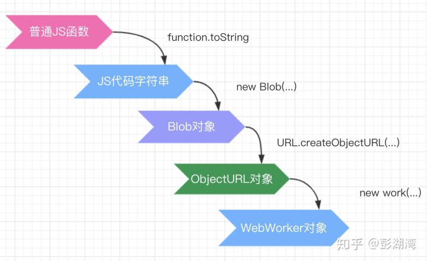

## What is the worker

浏览器是多线程的， 在浏览器中，存在下面几个线程：

* 浏览器事件触发线程
* UI 渲染线程
* JS 引擎线程
* 定时触发器线程
* http 请求线程

js 语言的一个重要特征是单线程，因为在js 中会设计到一些页面交互的逻辑， 比如操作 dom 树， css 样式树等， 单线程的设计避免了复杂的同步问题。

因为在 js 中我们是可以进行 dom 操作的， 因此 UI 渲染线程和 js 引擎线程是互斥的，如果我们在页面上要进行一些耗时较大的 js 逻辑计算的时候， 页面可能会出现卡顿现象。

为了利用多核 CPU 的计算能力，在 HTML5 中引入的工作线程使得浏览器端的 JavaScript 引擎可以并发地执行 JavaScript 代码，但是引入的工作线程并没有改变 js 单线程的本质， 因为子线程完全受主线程控制， 并且不能操作dom。

工作线程的一些特点：

* 工作线程内不能操作 dom，或者使用 window 对象下的一些属性和方法

* 工作线程和主线程之间通过消息传递系统实现，消息之间传递的数据是复制而不是共享一个存储空间（深复制和浅复制）

  > both sides send their messages using the `postMessage()` method, and respond to messages via the `onmessage` event handler (the message is contained within the `Message` event's `data` property). The data is copied rather than shared.

## How to create worker

一个 Worker 的创建是通过js 中的构造函数： `Worker()` 来实现的：

```js
var myWorker = new Worker(aURL, options);
```

具体看 [worker](<https://developer.mozilla.org/en-US/docs/Web/API/Worker/Worker>)

当我们创建一个 worker 的时候， 我们需要手动创建一个 js 文件，这种方式过于死板， 我们希望我们能直接指定在 worker 中运行的代码，而不需要创建多余的文件， 那有没有可能我们直接传入一个方法呢？

比如如下代码，我们对于函数代码进行了四次转换，从而实现将一个普通函数转换为 webWroker:

```js
function createWorker(workerFn) {
  const url = URL.createObjectURL(new Blob([`(${workerFn.toString ()})()`]));
  const worker = new Worker(url);
  let promiseResolve;
  worker.onmessage = (msg) => {
    promiseResolve(msg);
  }
  return (message) => {
    return new Promise(resolve => {
      promiseResolve = resolve;
      worker.postMessage(message);
    });
  }
}

const fn = () => {
  onmessage = (msg) => {
    console.log(`resceive message`, msg.data);
    postMessage('hello');
  }
}

const worker = createWorker(fn);

worker('send message').then(msg => {
  console.log('msg', msg.data);
});
```

上面代码实现了在不额外创建文件的情况下，实现创建 worker 代码的过程

如下是上面代码普通函数到 worker 的四种转换过程：





在上面的代码中，我们需要理解的是：

```js
URL.createObjectURL(new Blob([`(${workerFn.toString ()})()`]));
```

1. `Function.toString()` 方法可以将函数转换为代码字符串,例如上面的代码中， 执行完成

   `toString` 方法之后：


   ```
   // workerFn.toString ()
   () => {
     onmessage = (msg) => {
       console.log(`resceive message`, msg.data);
       postMessage('hello');
     }
   }
   ```

   > The **toString()** method returns a string representing the source code of the function.

2. `URL.createObjectURL()`

   `createObjectURL` 可以创建指向 blob 对象的 URL，  需要注意的是， 使用这种方法创建的

   是一个链接，这个链接指向数据对象， 这个数据对象可以是 [`File`](https://developer.mozilla.org/en-US/docs/Web/API/File), [`Blob`](https://developer.mozilla.org/en-US/docs/Web/API/Blob) or [`MediaSource`](https://developer.mozilla.org/en-US/docs/Web/API/MediaSource) 对象，真正的数据存放在 上面三种数据对象中。

   在上面的代码中， `URL.createObjectURL` 创建的链接， 指向的是保存有 ``(${workerFn.toString ()})()`` 的 blob 对象中

   关于 [createObjectURL](<https://developer.mozilla.org/en-US/docs/Web/API/URL/createObjectURL>)

## Worker-loader

[worker-loader](<https://github.com/webpack-contrib/worker-loader>) 是用来在 webpack 中实现 worker 的，核心代码如下：

``` js
var URL = window.URL || window.webkitURL;

module.exports = function (content, url) {
  try {
    try {
      var blob;

      try {
        // BlobBuilder = Deprecated, but widely implemented
        var BlobBuilder = window.BlobBuilder ||
        window.WebKitBlobBuilder ||
        window.MozBlobBuilder ||
        window.MSBlobBuilder;

        blob = new BlobBuilder();

        blob.append(content);

        blob = blob.getBlob();
      } catch (e) {
        // The proposed API
        blob = new Blob([content]);
      }

      return new Worker(URL.createObjectURL(blob));
    } catch (e) {
      // 这里对于 js 数据进行编码
      return new Worker('data:application/javascript,' + encodeURIComponent(content));
    }
  } catch (e) {
    if (!url) {
      throw Error('Inline worker is not supported');
    }

    return new Worker(url);
  }
};
```

使用多种不同的 api 主要是为了不同浏览器的兼容性问题，

## **参考链接**

1. [how-to-create-a-web-worker-from-a-string](https://stackoverflow.com/questions/10343913/how-to-create-a-web-worker-from-a-string)