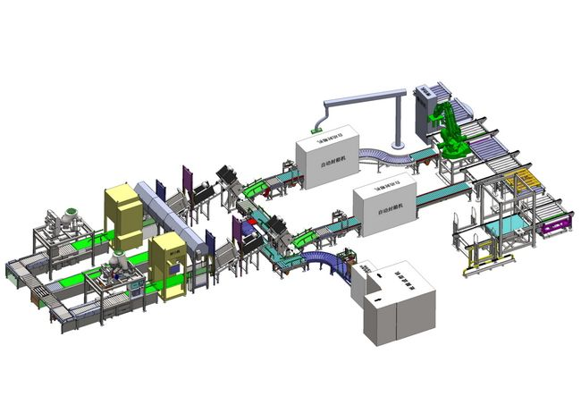
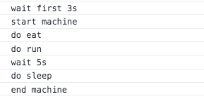

机器可以按照一定的顺序对于零件进行加工， 在程序中， 我们也可以实现一个机器函数， 这个函数可以按照我们调用函数的顺序进行执行。





实现一个类似于 `machine` 的函数：

```js
/**
 * 
 * @param {String} machineName 机器名称
 * @description 机器函数
 */
function machine(machineName) {
  let fnList = [];
  fnList.push(() => {
    console.log(`start ${machineName}`);
  });
  const doFnMap = {
    do(doName) {
      console.log(`do ${doName}`);
    },
    // 执行机器函数
    execute() {
      const handleFn = () => {
        if (fnList.length > 0) {
          const fnNow = fnList.shift();
          const fnVal = fnNow();
          if (fnVal instanceof Promise) {
            fnVal.then(() => {
              handleFn();
            });
          } else {
            handleFn();
          }
        } else {
          console.log(`end ${machineName}`);
        }
      };
      handleFn();
    },
    // 执行机器前等待时间
    waitFirst(time) {
      return new Promise(resolve => {
        setTimeout(() => {
          console.log(`wait first ${time}s`);
          resolve();
        }, time * 1000);
      });
    },
    waitEnd(time) {
      return new Promise(resolve => {
        setTimeout(() => {
          console.log(`wait end ${time}s`);
          resolve();
        }, time * 1000);
      });
    },
    // 执行过程中等待时间
    wait: (time) => {
      return new Promise((resolve) => {
        setTimeout(() => {
          console.log(`wait ${time}s`);
          resolve();
        }, time * 1000)
      })
    }
  };
  let proxy;
  // proxy 代理拦截
  // 获取到需要执行的函数名之后，将其放入执行函数队列数组
  proxy = new Proxy(doFnMap, {
    get: function (target, property) {
      return (...args) => {
        if (property !== 'execute') {
          if (property === 'waitFirst') {
            fnList.unshift(() => {
              return target.waitFirst(args);
            });
          } else {
            fnList.push(() => {
              return target[property](args);
            });
          }
          return proxy;
        } else {
          return doFnMap.execute();
        }
      };
    }
  });
  return proxy;
}
```

执行效果如下：

```js
 machine('machine').waitFirst(3).do('eat').do('run').wait(5).do('sleep').execute()
```

执行结果：





上面代码的主要思路是， 通过使用 `proxy` 获取到每一次的动作， 将每一次的函数存放到一个函数list 数组中， 当执行 `execute` 的时候， 依次执行数组中的函数， 在执行过程中进行判断， 当判断为 `wait`或者 `waitFirst` 函数的时候， 等待 `wait` 或者 `waitFirst` 函数执行完毕之后执行：

```js
// 对于 wait 或者 waitFirst 函数执行完毕之后返回了一个 promise
if (fnVal instanceof Promise) {
  fnVal.then(() => {
  	handleFn();
  });
} else {
  handleFn();
}
```

在执行过程中， 当调用执行方法的时候， 在代码中通过使用 `proxy` 进行拦截处理：

```js
proxy = new Proxy(doFnMap, {
    get: function (target, property) {
      return (...args) => {
        if (property !== 'execute') {
          if (property === 'waitFirst') {
            fnList.unshift(() => {
              return target.waitFirst(args);
            });
          } else {
            fnList.push(() => {
              return target[property](args);
            });
          }
          return proxy;
        } else {
          return doFnMap.execute();
        }
      };
    }
  });
```

使用 `Proxy` 方法用于对一个对象的属性访问和获取进行拦截， 在上面的代码中， 使用 `proxy` 中的 `get` 方法，设置了当调用 `doFnMap` 中的方法的时候， 调用`get` 方法，在 `get` 方法中， 可以用来将将要执行的函数方法推入到函数数组列表中以及调整函数的执行顺序。

