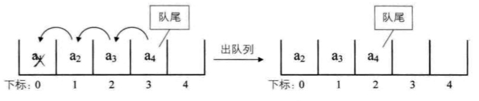

## 栈

栈是一种特殊的线性表，这种线性表仅允许在表尾（栈顶）进行插入和删除工作：

将可以被插入和删除元素的位置称为`栈顶`， 将另一端称为 `栈底`， 如果栈没有任何的元素， 这个栈被称为 `空栈`；

栈的数据元素的进出遵循后进先出的原则，简称为  *LIFO (Last In First Out)* 结构；

栈的插入被称为入栈， 栈的删除被称为出栈， 在程序中我们可以将其称为 `push` 和 `pop`;

在 js 中， 我们使用数组的 `push` 和 `pop` 方法模拟栈的入栈和出栈操作；

### 栈的应用

#### 递归

我们将调用函数自身或者间接调用自身的函数称为 *递归*

 在每一层递归的过程中， 我们需要存储当前调用函数的局部变量， 参数值等数据信息存储到栈中，当递归返回之后， 再将这些数据从栈中弹出数据

#### 使用栈实现四则运算表达式

如下面程序， 实现将一串运算表达式进行计算的代码：

```js
// 对于逆波兰法表示的后缀表达式计算求值
function RPNcompute(mathStrStack) {
  let stack = [];
  for (let num of mathStrStack) {
    if (Number.isNaN(+num)) {
      const num1 = stack.pop();
      const num2 = stack.pop();
      const total = num2 + num + num1;
      stack.push(eval(total));
    } else {
      stack.push(num);
    }
  }
  return stack.pop();
}

// 将中缀表达式转为后缀表达式
function toPostFixExpression(expression) {
  let expressionArr = expression.split(' ');
  let stack = [];
  let outputStr = '';
  // 处理符号入栈与出栈
  function pushStack(s) {
    let result = '';
    if (!stack.length) {
      stack.push(s);
      return '';
    };
    while (stack.length) {
      let stackTopData = stack.pop();
      if (s === ')') {
        if (stackTopData === '(') break;
        result += stackTopData + ' ';
      } else if (['+', '-', '*', '/'].includes(s)){
        const isLower = ['+', '-'].includes(s);
        // 当栈顶元素优先级大于等于当前入栈元素时， 栈顶元素依次出栈
        if (['/', '*'].concat(isLower ? ['+', '-'] : []).includes(stackTopData)) {
          result += stackTopData + ' ';
          if (!stack.length) {
            stack.push(s);
            break;
          };
        } else {
          stack.push(stackTopData);
          stack.push(s);
          break;
        }
      } else {
        stack.push(stackTopData);
        stack.push(s);
        break;
      }
    }
    return result;
  }
  for (let num of expressionArr) {
    if (Number.isNaN(+num)) {
      outputStr += pushStack(num);
    } else {
      outputStr += `${num} `;
    }
  }
  return outputStr + stack.reverse().join(' ');
}


function compute(mathStr) {
  let stackArr = toPostFixExpression(mathStr).split(' ');
  return RPNcompute(stackArr);
}
// 示例：
compute('9 + ( 3 - 1 ) * 3 + 10 / 2');
// 20
compute('9 + 3 * ( 2 + 2 / 2 ) - 10 / 5');
// 16
```

关于 中缀表达式转后缀表达式（逆波兰）法规则如下:

从左到右遍历中缀表达式的每个数字和符号，如果是数字那么就输出，成为后缀表达式的一部分，如果是符号， 那么判断该符号与栈顶符号的优先级，是右括号或者优先级低于等于栈顶符号， 那么栈顶符号依次出栈并输出，并将当前符号进栈， 一直到最终输出后缀表达式为止。

运算符号优先级： 乘除 > 加减

对于后缀表达式的计算规则如下：

从左到右遍历后缀表达式的每个数字和符号，如果遇到数字那么就入栈，遇到是符号， 那么就将处于栈顶的两个数字出栈， 进行运算，并将运算结果入栈， 一直到最终获得到结果。

## 队列

> 队列是只允许在一端进行插入操作， 而在另一端进行删除操作的线性表

队列遵循的是先进先出的线性表， 在程序设计中的应用， 比如我们在显示器上记事本上文字的输出。

在日常生活中， 比如我们购买火车票时的排队。

### 队列的线式存储结构

在 js 中， 我们使用数组的 `push` 和 `shift(表头弹出)` 这两个 api 实现队列的模拟。

#### 顺序存储

使用顺序存储时，我们将队列数据元素按照顺序存储到数组中， 当我们想要对于队列进行出列操作时， 因为出列操作是在表头出列， 因此，出列数据元素后面的每一个数据都会向前移动一个元素位置， 这样会造成程序性能的损耗。





这个时候的时间复杂度为  `O(n)`

为了解决这个移动队列数据元素的问题， 我们可以引入两个指针： `front`: 指向队头元素， `rear`: 指向队尾元素的下一个位置

当我们对于队列进行添加和删除元素的时候， 只要改变 `front` 和 `rear` 指针的位置就可以了， 不需要移动每个队列元素:

```javascript
function queue(queueLen) {
  const queueArr = new Array(queueLen);
  let front = 0;
  let rear = 0;
  this.out = function () {
    queueArr[front] = undefined;
    front ++;
    return queueArr;
  };
  this.add = function (data) {
    queueArr[rear] = data;
    rear ++;
    return queueArr;
  }
  return this;
}
```

对于上面的代码， 存在一个问题是， 如果我们当删除数据时， 队列不往前移动， 那么当我们新增队列数据元素的时候， 可以会增加到规定的队列长度之外的元素：

比如：

```js
const queueList = queue(2);

queueList.add(1);
queueList.add(2);
queueList.out();
console.log(queueList.add(3));
// [ undefined, 2, 3 ]
// 队列长度超出了我们规定的 2 的长度的队列长度
```

这个时候， 队列数据填充情况如下图所示：




这个时候虽然添加的数据位置超出了队列的长度， 但是删除的队列的第 0 位 和 第 1 位元素却是空的， 我们的溢出是“假溢出”。

我们思考， 如何能够利用删除之后的空间， 防止假溢出？

#### **循环队列**

循环队列相比上面的存储方法而言， 有一些不同， 主要是体现在  `rear` 指针的指向，`rear` 指针在队列初始化的时候指向下标 为 0 的位置,  当到达队列列尾的时候， `rear` 指针移动到队列列头

```js
function queue(queueSize) {
  const queueArr = new Array(queueSize);
  let front = 0;
  let rear = 0;
  this.out = function () {
    if (front === rear) {
      console.log('empty');
      return;
    };
    queueArr[front] = undefined;
    // 使用 %（取模）操作来进行归 0 操作
    front = (front + 1) % queueSize;
    return queueArr;
  };
  this.add = function (data) {
    if (isFull()) {
      console.log('full');
      return;
    };
    queueArr[rear] = data;
    rear = (rear + 1) % queueSize;
    return queueArr;
  }
  this.queueLength = function () {
    return (rear - front + queueSize) % queueSize;
  }
  function isFull() {
    return (rear + 1) % queueSize === front;
  }
  return this;
}

```

### 链式存储结构

队列的链式存储结构其实就是单链表。与普通的单链表不同的是， 只能操作链表的头部和尾部节点，

队列的链式存储结构被称为 `链队列`；

### 总结

当已知队列空间大小的情况下， 可以使用 `循环队列`， 否则， 如果不知道队列的长度， 使用 `链对列`

