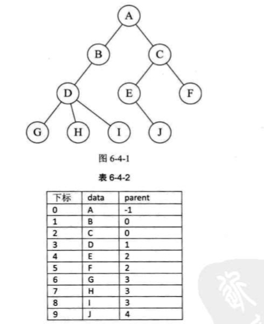
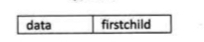
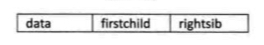
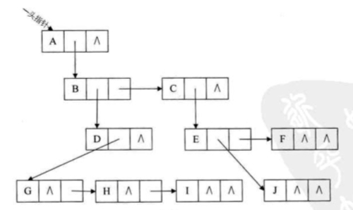
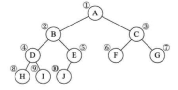
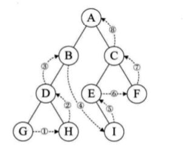

# 树

树是这样的一种结构：



对于树的定义如下：

> 树是 n (n >= 0) 个结点的有限集，n = 0 时称为空树，在任意一棵非空树中，
>
> 1. 有且仅用一个特定的称为 根（root）的节点
> 2. 当 n > 1 时，其余结点可分为 m（m > 0）个互不相交的有限集 T1, T2, ...Tn, 其中每一个集合本身也是一棵树， 并且称为 根的子树， 

对于树的存储方式， 可以使用三种表示法来存储树之间结点之间的相互关系：

双亲表示法， 孩子表示法， 孩子兄弟表示法

双亲表示法：

以一段连续的空间存储树的结点， 在每一个结点中，存储当前结点其双亲结点的存储位置：



data为数据域， 存储当前结点的相关数据， parent 为指针域， 存储当前节点的双亲结点在数组中的下标

比如下面的树使用双亲表示法表示：



根结点的双亲位置为 -1；

上面的表示法表示的树用于查找结点的双亲元素比较方便， 但是，如果这个结点下面包含有多个的子结点， 我们可以需要设置多个的指针域， 比如， 长子域， 右兄弟域等等。

孩子表示法：

孩子表示法的方式是：

将每个结点的孩子结点排列起来，以单链表作为存储结构，则 n 个结点有 n 个孩子链表，如果是叶子结点， 那么这个单链表为空，然后 n 个头指针又组成一个线性表，存放在一个一维数组中。

使用孩子表示法表示上面的树形结构：



在上面的孩子表示法中，设计有两种结构：

1. 孩子链表
   
   

   child 为数据域， 用来存储当前的子结点在表头数组中的下标， next 为指针域，存放的是下一个孩子的这个结构指针地址。

2. 表头结点
   
   

   表头结点存储每个结点， 用于树形结点的遍历使用，另外， 存储长子结点的指针域；

孩子兄弟表示法：

孩子兄弟表示法的数据结构如下：



data 为数据域

firstchild 为该结点第一个孩子结点的指针域

rightsib 为该结点的兄弟结点指针域

使用 孩子兄弟表示法组织后的数据结构如下：



上面的重新组织后的结构将一棵树转换为了一棵二叉树

## 二叉树

### 二叉树的定义

> 二叉树是 n 个结点的有限集合，该集合或者为空集（称为空二叉树），或者由一个根结点和两棵互不相交的，分别称为 根结点的左子树和右子树的二叉树组成 

二叉树的特点：

1. 每个结点最多有两棵子树
2. 左子树和右子树是有顺序的， 并且不能颠倒
3. 即使树中某结点只有一棵子树，也要区分顺序

如下图， 是一棵二叉树的示意图：



根据二叉树的结构显示， 可以将二叉树分为：满二叉树， 斜树 和 完全二叉树；

如下， 是满二叉树的图示：



树的每个结点都有左右两个结点， 故称为满二叉树。

### 二叉树的存储

#### 顺序存储

按照顺序存储二叉树， 主要是使用一维数组来顺序存储树中的各个结点，比如， 存储如下树结构：



使用顺序存储如下：



对于不存在的结点， 我们将不存在的结点设为 `^` 即可。

使用顺序存储存在的问题在于， 我们需要对于不存在的结点分配存储空间，比如，对于下面这个右斜树而言：



这样造成了存储空间的浪费。

#### 链式存储

对于二叉树结点的存储， 我们使用一种被称为 “二叉链表” 的链式存储结构来存储，

二叉链表是下面的这种结构：



这个结构中包含有一个数据域和两个指针域， 数据域表明当前结点的数据，指针域分别为二叉树左右两个结点的地址指针。

使用链式存储后的最终的存储链表结构如下：



### 二叉树的遍历

二叉树的遍历是指从根结点出发， 依次访问到二叉树中的每一个结点，使得每个结点被访问到并且仅被访问到一次。

二叉树的遍历方法， 按照访问次序的不同， 可以分为 前序遍历， 中序遍历 以及 后序遍历

#### 前序遍历

前序遍历的遍历顺序是先访问二叉树的左子树， 然后访问二叉树的右子树




如， 上图， 二叉树的访问顺序是：

ABDGHCEIF

#### 中序遍历

中序遍历根结点的左子树，然后是访问根结点，最后中序遍历右子树




如上图， 那么 二叉树的访问顺序是：

GDHBAEICF

#### 后序遍历

判断二叉树是否为空， 如果是空， 那么空操作返回，否则的话， 从左到 右通过先叶子后结点的方式遍历访问左右子树






使用后序遍历的方法来访问二叉树的顺序是：

GHDBIEFCA

### 二叉树的创建

二叉树的创建可以像二叉树创建方法中传入一串树来实现，通过一定的二叉树的遍历顺序来依次创建结点， 对于空结点， 二叉树中的字符串可以为 ‘#’

按照前序遍历创建的二叉树的方法如下:

```js
// 创建二叉树
// treeStr: 树的字符串， 空结点 ‘#’
function createTree(treeStr) {
  let tree = {};
  // 创建树节点
  let treeStack = treeStr.split('');
  function createNode(node) {
    let nodeData = treeStack.shift();
    if (!nodeData) return;
    if (nodeData !== '#') {
      node.data = nodeData;
    } else {
      return true;
    }
    // 当父节点没有左结点的时候， 创建左结点
    if (!node.lChild || !node.lChild.hasOwnProperty('data')) {
      if (treeStack.length >= 1) node.lChild = {};
      if (createNode(node.lChild)) delete node.lChild;
    }
    if (!node.rChild || !node.rChild.hasOwnProperty('data')) {
      if (treeStack.length >= 1) node.rChild = {};
      if (createNode(node.rChild)) delete node.rChild;
    }
    return;
  }
  createNode(tree);
}
```

对于树的创建和访问一样， 也是进行依次遍历， 使用递归进行遍历访问， 需要注意的是：

要存在相应的条件， 使得能够跳出递归。

对于递归而言， 注意递归循环的跳出是比较重要的。

同样，也可以按照中序遍历和后序遍历的次序来创建树， 只是递归的顺序不同而已。

另外， 判断对象中某个属性是否存在， 最好不要用直接访问属性的方式进行判断， 因为不知道这个属性的值可能是 `undefined`,  或者 `0` 等导致属性访问后为 `false` 的值。

可以使用 `hasOwnProperty` 的方式来判断属性是否在对象上面:

```
Object.hasOwnPropery(prop);
```

注意： 这个方法只能够获取到该对象上面的自身属性， 不能获取到该对象原型上面的属性

（for in 是可以获取到继承的属性的， 并且继承的属性是可枚举的）

为了防止对象上面有 `hasOwnProperty` 属性覆盖掉从对象上面继承的， 我们需要通过 `Object` 来调用：

```
Object.hasOwnProperty.call(obj, 'property');
```


