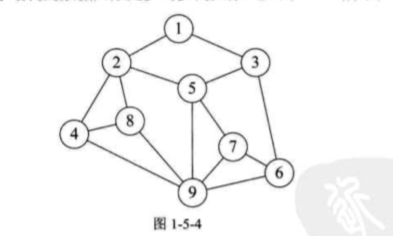
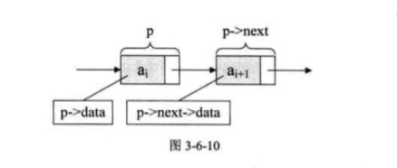

## 数据结构简介

> 数据结构是相互之间存在一种或者多种特定关系的数据元素的集合

数据结构分为**逻辑结构**和**物理结构**；

数据对象中数据元素之间的关系称为逻辑结构， 在数据结构中， 存在下面四种逻辑结构：

* 集合结构

  集合结构中的元素除了同属于同一集合之外。 没有其他的任何关系， 如同所示：

  

  

* 线性结构： 线性结构中的元素是一对一的关系：

  

  

* 树形结构：树形结构中的元素关系是一对多的层次关系, 比如： 二叉树

  

  

* 图形结构： 图形结构中的元素之间的关系是一对多的关系

  


  

物理结构： 是指数据的逻辑结构在计算机中的存储方式；

物理结构包括顺序存储结构和链式存储结构；

顺序存储结构的数据逻辑关系和物理关系是一致的， 即是数据存放在地址连续的存储单元里面；

链式存储结构数据间的存储地址并不连续，数据之间的存储关系并不表示他们之间的逻辑关系，这些数据的地址信息存放在数据的指针中。通过数据的指针来表明数据之间的存储关系。

## 数据结构之线性表

> 线性表是零个或者多个数据元素的有限序列

线性表是一种序列， 这表明线性表中数据的关系之间都是一对一的关系，如果元素存在多个， 那么第一个元素没有前元素， 最后一个元素没有后元素， 其他元素有且只有一个前元素和后元素，

### 线性表的顺序存储结构

顺序存储结构是物理结构和逻辑结构一致的一种结构， 比如， 我们使用一个一维数组来存储数据，实现顺序存储结构；

```js
let list  = [1, 2, 3, 4];
```

在顺序存储结构中， 地址和数据之间的关系是一致的，比如， 我们想要获取 第 i 个元素， 我们可以通过   `list[i - 1]` 来获取数据。

#### 删除和插入元素

当我们需要删除或者插入元素的时候， 对于顺序存储结构需要移动比较多的元素， 当我们需要删除一个元素， 需要将该数据项后面的数据都需要向前提前一位：

```js
// 从线性表中删除某个数据
function deleteData(list, i) {
  if (list.length === 0) return list;
  if (i < 1 || i > list.length) return list;
  if (i < list.length) {
    for (let index = i; index < list.length; index ++) {
      list[index -1] = list[index];
    }
  }
  list.length --;
  return list;
}

let list = [1, 2, 3, 4];

console.log(deleteData(list, 2));
// [1, 3, 4]
```

对于线性表的插入和删除数据操作，其时间复杂度为 O(n);

#### 优缺点

对于线性表的顺序存储结构， 其优点是：

1. 可以快速的存取表中任意位置的元素
2. 无须为表中的逻辑关系增加额外的存储空间

缺点：

对于线性表中插入和删除元素操作需要移动大量的元素

### 线性表的链式存储结构

顺序存储结构对于插入和删除元素需要移动大量元素的原因是数据之间的逻辑关系和存储关系一致且相互之间按照次序排列，需要移动大量的元素来保持相互之间的存储关系和逻辑关系的一致。

这种问题可以通过使用链式存储结构来解决，链式存储结果的特点是逻辑关系和存储关系分离， 当逻辑关系改变时， 不会引起存储关系的变化

线性表的链式结构由一个个的节点（Node）构成， 每个节点中包含有一个数据域和一个或者多个指针域， 顾名思义， 数据域用于存储当前节点的数据， 指针域用来存储下一个节点的位置信息， 根据节点中指针域的数量不同， 将链表分为单链表和双链表；

#### 单链表

单链表示意图如下：




在上图中我们可以看到， 在链表中相邻的数据的存储位置并不连续，数据之间的关系通过节点中的指针域中的地址来表明。

一些要点：

1. 链表中的最后一个节点的指针为空， 我们常常将其置为 `null`
2. 为了更方便的对于链表进行操作， 我们在第一个节点之前设置一个头节点，这个节点的指针指向第一个节点， 节点中的数据可以包含有链表的长度等信息。
3. 头指针不为空，是链表的必要元素

链表中节点之间的逻辑关系如图所示：





##### 单链表的读取

链表中数据的关系是通过指针来表示的，想要读取单链表的数据，我们需要通过指针来操作， 比如读取程序如下:

```js
// 创建一个新的链表
function linkList() {
  let list = {
    data: { length: 0 },
    next: null
  };
  const headNodeData = list.data;
  // 链表新增节点
  this.add = function (value) {
    let node = { data: value, next: null };
    let next = list.next;
    let currentNode = list;
    while (next) {
      currentNode = next;
      next = next.next;
    }
    currentNode.next = node;
    headNodeData.length ++;
    return list;
  }
  // 获取链表中的某个节点
  this.get = function (i) {
    if (i < 1 || i > headNodeData.length) return null;
    let next = list.next;
    let nodeIndex = 0;
    while (next) {
      nodeIndex ++;
      if (i === nodeIndex) break;
      next = next.next;
    }
    return next;
  }
  return this;
}

let linkedList = linkList();
linkedList.add(1)；
// { data: { length: 1 }, next: { data: 1, next: null } }
linkedList.get(1)；
// { data: 1, next: null }
```

单链表的查找数据的核心思想是**工作指针后移**；

