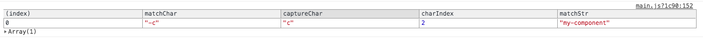
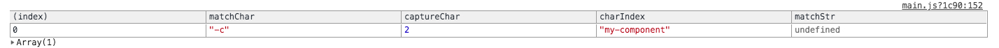

下面是一些正则表达式的一些常用方法：

# 正则表达式中的属性和方法

创建了正则表达式之后， 返回的是一个正则表达式的实例，返回的实例中包含有正则的一些属性方法。

我们可以在 控制台中打印正则实例， 可以看到其继承的所有的属性和方法如下：

例如：

```
let pattern = /.at/g;
let str = 'bat, cat';
let matches = pattern.exec(str);
console.log('lastIndex', pattern.lastIndex); // 3
```

###  一些属性

| 属性            | 含义                                                         | 示例                                                         |
| --------------- | ------------------------------------------------------------ | ------------------------------------------------------------ |
| `lastIndex`     | 下一次匹配在字符串中的起始位置,  当前匹配到字符串的下一个字符的位置 ， 注意， 当前缺少修饰符 `g` 的时候， 这个值始终是 0 | 上面的例子中， 匹配完了  bat 之后， 后面将要进行匹配的是 `,` 位置为 3 |
| `flags`(es6)    | 获取当前正则的修饰符                                         | g                                                            |
| `global`        | 布尔值， 表示是否设置了 g 标志                               | `pattern.global`: true                                       |
| `ignoreCase`    | 布尔值， 表示是否设置了 i 标志                               |                                                              |
| `multiline`     | 表示是否设置了 m                                             |                                                              |
| `sticky`        | 表示是否这种了 y 标志                                        |                                                              |
| `dotall` es2018 | 表示是否含有 s 修饰符                                        |                                                              |
| `source`        | 表示当前的匹配字符串                                         | ".at"                                                        |

Tips:

-   使用 `lastIndex` 是可以改变的， 使用 `lastIndex` 可以决定需要进行开始匹配的位置

  ```js
  let pattern = new RegExp('.at', 'g');
  let str = "cat, bat";
  
  pattern.lastIndex = 4;
  let matches = pattern.exec(str);
  // matches
  // [ 'bat', index: 5, input: 'cat, bat', groups: undefined ]
  ```


### 一些方法

#### RegExp.prototype.test

使用 test 方法用于判断在一个字符串中是含有能够匹配的到字符：

示例：

```javascript
let pattern = /test/g;
let str = 'test string';
pattern.test(str); // true
```

```javascript
let pattern = /[cb]at/g;
let str = "cat, bat";
pattern.test(str); // true
```

#### `RegExp.prototype.exec`

 使用  `exec` 方法用于获取到匹配到的数组：

```
let pattern = /.at/;
let str = "cat, bat";

let matches = pattern.exec(str);
// [ 'cat', index: 0, input: 'cat, bat', groups: undefined ]
// 当前匹配到 字符串是 cat， 匹配的字符串在原字符串中的开始位置为 0， input： 当前被匹配的字符串为 
// 'cat, bat'
```

如果有匹配到值的话， 返回一个数组， 如果没有匹配到值， 返回 `null`;

使用 `exec` 方法返回的是一个数组，这个数组包含被匹配到的字符串，（在存在捕获组的情况下， 获取到的被匹配的字符串不止一个） 比如上面的代码中， 匹配到了 `cat`  但是这个数组实例上面还定义了一些属性, 例如上面的数组中包含了 `index`, `input` 以及 `groups` ， 这些属性表示的是被匹配到的字符串的相关信息， 这些属性的含义如下：

- `index`: index 表明匹配数组中第一个值在字符串中的位置。
- `input`：input 表明当前匹配的字符串
-  `groups`: groups 是 es2018 中提出的一个新的方法  

> 注意： 当正则表达式中包含有全局匹配 `g` 的时候，每次调用 `exec` 都会在上一次匹配的位置之后继续进行匹配,  当没有设置全局匹配 g 的时候， 多次调用  `exec` 只会调用第一次匹配到的信息。

```js
let pattern = new RegExp('.at', 'g');
let str = "cat, bat, dat";
let matches = pattern.exec(str);

while(matches) {
  console.log(pattern.lastIndex, matches[0]);
  matches = pattern.exec(str);
}
// 3 'cat'
// 8 'bat'
// 13 'dat'
```

### 应用正则表达式的一些方法：

#### `String.prototype.match`

`str.match(regexp)`

接收一个正则表达式， 如果有匹配到的字符串， 将会返回一个数组， 数组的第一项是进行匹配的字符串， 后面几项是获取到的捕获组的结果， 如果没有匹配到的字符串， 那么将会返回 null。

> 注意， 在使用 `match` 方法的时候加不加标识符 g 是有区别的， 当正则中不含有 g 标识符的时候， 返回的结果是标准的匹配格式： 数组的第一个元素是整体匹配的内容，其他元素是分组捕获的内容， 如果加上了 g 符号， 那么返回的是包含有所有匹配的字符串内容：
>
> 例如下面这个例子：
>
> ```as1
> var regex = /(\d{4})-(\d{2})-(\d{2})/g;
> var string = "2017-06-12";
> console.log( string.match(regex) );
> // ["2017-06-12"] 没有获得到捕获组 括号内的匹配项
> // 当正则表达式中不含有 g 标识符的时候
> regex = /(\d{4})-(\d{2})-(\d{2})/;
> // ["2017-06-12", "2017", "06", "12"]`String.prototype.search`
> // 返回内容为整体匹配以及分组匹配的内容. 	l;`	
> ```


#### `String.prototype.search`

`str.search(regexp)`

接收一个正则表达式， 返回在字符串中第一次被匹配到的位置， 如果没有匹配到， 返回 -1

```
let str = 'hello world';
str.search(/world/); // 6
```

使用 `indexOf` 方法也可以用来查找到字符串中的某一个字符， 相比 `indexOf` 方法， 个人认为 `search `

 方法的优点在于可以借助于正则表达式中的一些功能， 比如， 我们可以不区分大小写的进行查找字符串中的某一个单词：

```js
let str = "search Word";
str.search(/word/i); // 6
```

**注意：**

**当我们使用 `search` 方法的时候， 当向 search中传入字符串的参数的时候， 字符串参数会被转换为正则表达式**

如下：

 ```js
let str = "2019.02.05";
str.search('.'); // 0
// 因为上面的方法中转换为了 str.search(/./); 相当于匹配任意的字符， 从而匹配到第一个字符， 匹配到的位置为 0
 ```


#### `String.prototype.replace`

`str.replace(regexp, replaceStr)`

使用 replace 方法可以实现对于匹配到的字符串进行替换, 匹配过程中不会改变原来的进行匹配的字符串，返回值为进行匹配完成的字符串。

注意： 使用 `replace` 方法的时候 `replaceStr` 中使用 `$1`, `$2` 以及 `$3` 可以表示 `RegExp.$1`, `RegExp.$2`

`RegExp.$3`  

如下， 转换日期的格式问题：

```
let str = '2018-02-02';
let regex = /(\d{4})-(\d{2})-(\d{2})/;
str.replace(regex, '$3/$2/$1'); // 02/02/2018
```

如下， 隐藏手机号码中间四位的数字：

```
let str = '15656568620';
let regex = /(\d{3})(\d{4})(\d{4})/;
str.replace(regex, '$1****$3');
// 156****8620
```

使用 `replace` 可以实现更为强大的功能， 因为第二个参数的 `replaceStr` 可以有多个具有特殊含义的字符：

| 属性                | 描述符                                      |
| ------------------- | ------------------------------------------- |
| `$1` `$2` ... `$99` | 匹配地 `$1` , `$2` ... `$99` 分组捕获的文本 |
| `$&`                | 匹配到的子串文本                            |
| $`                  | 匹配到的子串的左边文本                      |
| $'                  | 匹配到的子串的                              |
| $$                  | 表示美元符号                                |
| 其他符号            | 符号本身                                    |

如下， 我们想要将一段金钱文字都添加上一个 `$` 符号：

```js
let str = '100, 200, 300';
let regex = /(\d+)/g;
str.replace(regex, '$$ $&');
// $100, $200, $300
```

>使用 `replace` 我们不仅仅可以实现对于一串字符串中某个字符的替换， 更强大的作用在于， 使用 `replace` 可以实现对于匹配到的字符串进行统一处理， 这样， 我们就无需手动查找字符串中的某个值，然后逐个替换了。

**<a  name="replaceFn">replace 第二个参数除了接受一个字符串之外， 还可以接受一个函数</a>**

如下：

```js
function replaceStr (matchChar, captureChar, charIndex, matchStr) {
  console.table([{ matchChar, captureChar, charIndex, matchStr }]);
  return captureChar ? captureChar.toUpperCase() : '';
}
// 将连字符相连的单词转换为驼峰式的写法
function camelize(str) {
  return str.replace(/-(\w)/g, replaceStr)
}
camelize("my-component");
```

最终打印结果如下：



上面各个参数如下：

| matchChar(第一个参数)  | captureChar(第二个参数) | charIndex(第三个参数)              | matchStr(第四个参数) |
| ---------------------- | ----------------------- | ---------------------------------- | -------------------- |
| 正则匹配匹配到的字符串 | 捕获组捕获到的字符      | matchChar 在整个字符串中的起始位置 | 被匹配的字符串       |

注意： 当匹配正则中没有 `()` 也就是没有捕获组的时候， 参数总体向前挪动， 最后一个参数为  `undefined`

例如上面的代码中：修改为如下：

```js
function replaceStr (matchChar, captureChar, charIndex, matchStr) {
  console.table([{ matchChar, captureChar, charIndex, matchStr }]);
  // return captureChar ? captureChar.toUpperCase() : '';
}
function camelize(str) {
  return str.replace(/-\w/g, replaceStr)
}

camelize("my-component");
```

最终打印结果如下：





上面可以看到， 当正则中没有捕获组了之后， 捕获组参数 `captureChar` 消失掉了， `charIndex` 以及 `matchStr` 参数向前挪动了一位， 从而导致最后一位为 `undefined`

### 其他

1. 使用 `$1` `$2` .. 可以获取到被匹配到的捕获组中的数据， `$1` 获取到第一个捕获组数据， `$2` 获取到第二个捕获组数据， 依次类推

   例如：

   ```js
   str = '2018-02-02';
   regex = /(\d{4})-(\d{2})-(\d{2})/;
   regex.test(str);
   RegExp.$1 // 2018
   RegExp.$2 // 02
   RegExp.$3 // 02
   ```

2. 可以在正则中使用 `\1` 或者 `\2` 之类的表示引用分组 `$1`  `$2` ....， 例如： 

   我们想要匹配如下的日期格式：

   2019-02-05

   2019.02.05

   2019/02/05

   我们注意到， 对于   `-` 或 `.` 或 `/` 是重复使用的， 因此， 我们可以在正则表达式中引用这个分组：

   ```
   let regex = /\d{4}(-|\/|\.)\d{2}(-|\/|\.)\d{2}/;
   let str = '2019-02-05';
   regex.test(str); // true
   ```

   但是上面的正则也可以匹配到 2019-02.05 这样的格式；

   当匹配的字符串中出现重复匹配的内容， 并且匹配规则相同的时候， 我们可以使用分组引用：

   ```
   let regex = /\d{4}(-|/\|\.)\d{2}\1\d{2}/;
   ```

   如下： 匹配 html 中的匹配标签：

   ```js
   let html = "<p>我是一段文字</p>";
   let regex = /<([^>]+)>[\d\D]*<\/\1>/;
   regex.test(html); // true
   // 注： 这里的 [\d\D] 表示匹配 \d 或 \D, 也就是匹配任意的字符
   // 匹配含有 class 的元素属性
   html = "<p class="content">我是一段文字</p>";
   regex = /<([^>]+).*>[\d\D]*<\/\1>/;
   regex.test(html) // true
   ```
